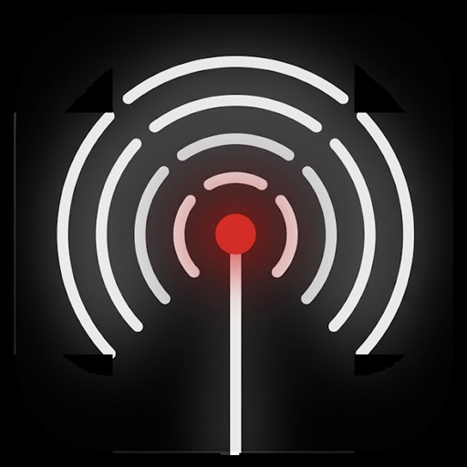

<p align="center">
  
</p>

<h1 align="center">PING</h1>

<p align="center">
  <strong>Decentralized • Off-Grid • Zero-Knowledge Mesh Network & Edge AI</strong>
</p>

<p align="center">
  
  
  
  
  
  
</p>

---

## Overview

**Ping** is an off-grid tactical communications engine and edge-intelligence terminal designed for sovereign, peer-to-peer data interchange in disconnected, degraded, and internet-free environments.

Built from the ground up on modern Android (Phone & Wear OS), Ping eliminates all dependencies on centralized servers, cell towers, user accounts, and phone numbers. Identity is strictly sovereign and cryptographic. Transport routes dynamically through local radio mesh layers—hopping across nearby devices over Bluetooth Low Energy and Wi-Fi Aware—while seamlessly federating across global Nostr relays whenever an internet uplink becomes available.

Ping integrates **Ping AI**, an air-gapped on-device Retrieval-Augmented Generation (RAG) engine that provides instant emergency survival and tactical knowledge without network connectivity, capable of cooperative query resolution across the physical mesh.

---

## Core Pillars

```
                     ┌────────────────────────────────────────┐
                     │            PING APPLICATION            │
                     │  (OLED Monochromatic Minimalist UI)   │
                     └───────────────────┬────────────────────┘
                                         │
        ┌────────────────────────────────┼────────────────────────────────┐
        ▼                                ▼                                ▼
 ┌─────────────┐                  ┌─────────────┐                  ┌─────────────┐
 │   PING AI   │                  │ ZERO-TRUST  │                  │  TACTICAL   │
 │ On-Device   │                  │ CRYPTO CORE │                  │  OPERATIONS │
 │ Local RAG & │                  │ Noise XX &  │                  │ Emergency   │
 │ Mesh Query  │                  │ ChaChaPoly  │                  │ SOS & Globe │
 └──────┬──────┘                  └──────┬──────┘                  └──────┬──────┘
        │                                │                                │
        └────────────────────────────────┼────────────────────────────────┘
                                         ▼
                     ┌────────────────────────────────────────┐
                     │         HYBRID TRANSPORT MATRIX        │
                     │ ┌──────────────┬─────────────────────┐ │
                     │ │ BLE Mesh     │ Multi-Hop Routing   │ │
                     │ │ Wi-Fi Aware  │ High-Bandwidth P2P  │ │
                     │ │ Nostr Relays │ Global Relay Sync   │ │
                     │ └──────────────┴─────────────────────┘ │
                     └────────────────────────────────────────┘
```

### 1. Zero-Infrastructure Multi-Transport Mesh
- **Bluetooth Low Energy (BLE) Multi-Hop**: Autonomous ad-hoc packet propagation with dynamic hop-limiting (TTL), packet deduplication, Bloom-filtered state gossip, and MTU-aware fragmentation.
- **Wi-Fi Aware (NAN)**: High-speed local peer-to-peer transport negotiated on demand for low-latency voice memos, encrypted photo streams, and large binary payloads.
- **Global Nostr Relay Sync**: Automatic, transparent failover to decentralized Nostr relays via WebSockets when wide-area connectivity is detected.

### 2. Ping AI — Edge RAG & Cooperative Mesh Intelligence
- **100% On-Device Execution**: Runs vectorized retrieval and Small Language Models (SLMs) locally in sandboxed hardware storage without transmitting prompts to cloud servers.
- **Field Manuals & Emergency Protocols**: Embedded offline manuals spanning field trauma care, emergency water purification, structural hazards, and off-grid power management.
- **Decentralized Mesh Query Delegation**: If a local node lacks specific manual data, it broadcasts a cryptographic query across the local BLE mesh, allowing neighboring nodes with richer datasets to synthesize and relay verified guidance back to the requester.

### 3. Sovereign Zero-Knowledge Cryptography
- **Noise Protocol Framework**: Implements `Noise_XX_25519_ChaChaPoly_SHA256` for mutual peer authentication and end-to-end authenticated encryption with ephemeral key ratcheting.
- **Perfect Forward Secrecy (PFS)**: Compromise of long-term identity keys never exposes historical conversation transcripts.
- **Biometric & QR Out-of-Band Verification**: Cryptographic key fingerprints are verifiable face-to-face via high-density dynamic QR codes or deterministic visual signatures.
- **Ephemeral Storage**: All messages, cryptographic secrets, and mesh cache entries can be securely wiped with a rapid triple-tap panic gesture.

### 4. Tactical Safety & Emergency SOS
- **3-Second Guarded SOS Beacon**: Intentional long-press trigger initiates emergency flood routing across all available transport radios.
- **Geohash-Tagged Telemetry**: Broadcasts location, battery health, and distress tags to all reachable receivers across neighborhood frequencies.
- **Acoustic & Haptic Strobe**: Activates audio frequency beaconing for search-and-rescue localization in zero-visibility conditions.

### 5. Geohash Spatial Matrix & 3D Interactive Globe
- **Frequency Subdivision by Coordinates**: Chat rooms partition organically based on Geohash resolution—from regional macro-zones down to micro-block proximity channels.
- **Vectorized 3D Globe**: Real-time interactive wireframe globe interface allowing manual inspection and selection of geographic channels worldwide.

### 6. Grid-Down Peer Bootstrapping (Hotspot APK Server)
- **Air-Gapped App Distribution**: Ping nodes can act as independent deployment stations.
- **Embedded Web Server (NanoHTTPD)**: Spawns an isolated local Wi-Fi access point with a captive portal, allowing unequipped Android devices nearby to download, verify, and install the Ping APK directly over local Wi-Fi without internet or Google Play.

### 7. Offline Ecash Micropayments
- **Cashu Protocol Integration**: Transmit and redeem bearer ecash tokens peer-to-peer directly over raw BLE packets.
- **Frictionless Offline Settlements**: Execute micro-transactions and peer resource trades without bank servers or blockchain connectivity.

---

## Design Philosophy

Ping's interface is built according to an **Industrial Swiss-Minimalist** design language inspired by functionalist industrial design and Nothing OS:

- **True OLED Black (`#000000`) Canvas**: Maximizes battery endurance on AMOLED displays in extended emergency field conditions.
- **Hierarchical Monochromatic Grayscale**: Uses pure value contrast and typographic scale rather than colored visual noise.
- **Deliberate Signal Red (`#D71921`)**: Reserved exclusively for critical alerts, emergency triggers, and active system signals.
- **Technical Typography**: Powered by **Space Grotesk** for clean structural legibility, **Space Mono** for telemetry, coordinates, and cryptographic hashes, and **Doto** dot-matrix accents.

---

## Protocol Specification

### Packet Wire Format (v2)

Each transport frame is binary-encoded for minimal transmission overhead across restricted radio channels:

```
 0                   1                   2                   3
 0 1 2 3 4 5 6 7 8 9 0 1 2 3 4 5 6 7 8 9 0 1 2 3 4 5 6 7 8 9 0 1
+-+-+-+-+-+-+-+-+-+-+-+-+-+-+-+-+-+-+-+-+-+-+-+-+-+-+-+-+-+-+-+-+
|  Magic (0x5047 / "PG")        | Version (0x02)| Message Type  |
+-+-+-+-+-+-+-+-+-+-+-+-+-+-+-+-+-+-+-+-+-+-+-+-+-+-+-+-+-+-+-+-+
|                         Sequence Number                       |
+-+-+-+-+-+-+-+-+-+-+-+-+-+-+-+-+-+-+-+-+-+-+-+-+-+-+-+-+-+-+-+-+
|      TTL      |   Hop Count   |           Reserved            |
+-+-+-+-+-+-+-+-+-+-+-+-+-+-+-+-+-+-+-+-+-+-+-+-+-+-+-+-+-+-+-+-+
|                                                               |
+                    Sender Public Key (32 B)                   +
|                                                               |
+-+-+-+-+-+-+-+-+-+-+-+-+-+-+-+-+-+-+-+-+-+-+-+-+-+-+-+-+-+-+-+-+
|       Payload Length          |     Encrypted Payload ...     |
+-+-+-+-+-+-+-+-+-+-+-+-+-+-+-+-+-+-+-+-+-+-+-+-+-+-+-+-+-+-+-+-+
|                Poly1305 Authentication Tag (16 B)             |
+-+-+-+-+-+-+-+-+-+-+-+-+-+-+-+-+-+-+-+-+-+-+-+-+-+-+-+-+-+-+-+-+
```

### Supported Slash Commands

Command-line interactions are supported directly in the conversation input:

| Command | Arguments | Description |
|---------|-----------|-------------|
| `/pingai` | `<query>` | Query offline emergency intelligence (aliases: `/ai`, `/guide`, `/lantern`) |
| `/j`, `/join` | `<channel>` | Create or join a location channel or custom frequency |
| `/m`, `/msg` | `<peer> <text>` | Dispatch an encrypted direct message |
| `/channels` | — | Display all locally discovered radio channels |
| `/w` | — | List reachable peers currently active in the mesh |
| `/pay` | `<token>` | Disseminate an offline Cashu ecash bearer payment |
| `/block` | `<peer>` | Block a compromised or noisy peer ID |
| `/unblock`| `<peer>` | Reinstate a previously muted peer |
| `/clear` | — | Purge volatile message log from the current viewport |

---

## Project Structure

```
inception/
├── app/                                # Core Android Application
│   └── src/
│       ├── main/
│       │   ├── java/com/inception/android/
│       │   │   ├── core/               # Shared base abstractions & tokens
│       │   │   ├── crypto/             # AES-256-GCM, Argon2id, KeyStore management
│       │   │   ├── geohash/            # Coordinate subdivision & spatial channel logic
│       │   │   ├── hotspot/            # Local APK deployment server (NanoHTTPD)
│       │   │   ├── lantern/            # Ping AI RAG engine, inference & model hub
│       │   │   ├── mesh/               # BLE mesh service, packet routing & flooding
│       │   │   ├── noise/              # Noise Protocol implementation (XX handshake)
│       │   │   ├── nostr/              # Global relay transport & WebSocket client
│       │   │   ├── protocol/           # Binary packet encoding / decoding
│       │   │   ├── ui/                 # Jetpack Compose UI & screens
│       │   │   └── wifiaware/          # Wi-Fi Aware high-throughput service
│       │   └── res/                    # Assets, fonts (Space Grotesk, Doto), icons
│       └── test/                       # Unit & cryptographic validation tests
├── wear/                               # Wear OS Companion Module
├── gradle/                             # Version catalog (libs.versions.toml) & wrapper
└── build.gradle.kts                    # Root build configuration
```

---

## Getting Started

### Prerequisites
- **JDK 17 or JDK 21** (OpenJDK recommended)
- **Android SDK Platform 37** (Android 15+)
- **Android Studio Ladybug (2024.2+)** or command-line build tools
- Android device running **Android 8.0 (API 26)** or higher with **Bluetooth Low Energy** support

### Building from Source

1. **Clone the repository:**
   ```bash
   git clone https://github.com/ryuma04/ping.git
   cd ping
   ```

2. **Verify environment:**
   ```powershell
   # Windows PowerShell
   $env:JAVA_HOME
   ```

3. **Assemble Debug APK:**
   ```bash
   # Windows
   .\gradlew.bat assembleDebug

   # macOS / Linux
   ./gradlew assembleDebug
   ```

4. **Install to connected device via ADB:**
   ```bash
   adb install -r app/build/outputs/apk/debug/app-debug.apk
   ```

5. **Run test suite:**
   ```bash
   .\gradlew.bat testDebugUnitTest
   ```

---

## Security & Threat Model

- **No Central Registry**: Identity is determined strictly by an `Ed25519` / `X25519` keypair generated in hardware-backed Android Keystore when supported.
- **Traffic Analysis Resistance**: Protocol packets are padded to standardized chunk boundaries to prevent payload size fingerprinting.
- **Zero Cleartext Over the Air**: All multi-hop transmissions and channel broadcasts are authenticated and encrypted. Unauthenticated peers cannot inspect message routing parameters beyond immediate hop headers.
- **Anti-Replay Protection**: Time-stamped nonces and sliding sequence windows eliminate replay attacks across network relays.

---

## License

This project is licensed under the [MIT License](LICENSE).
